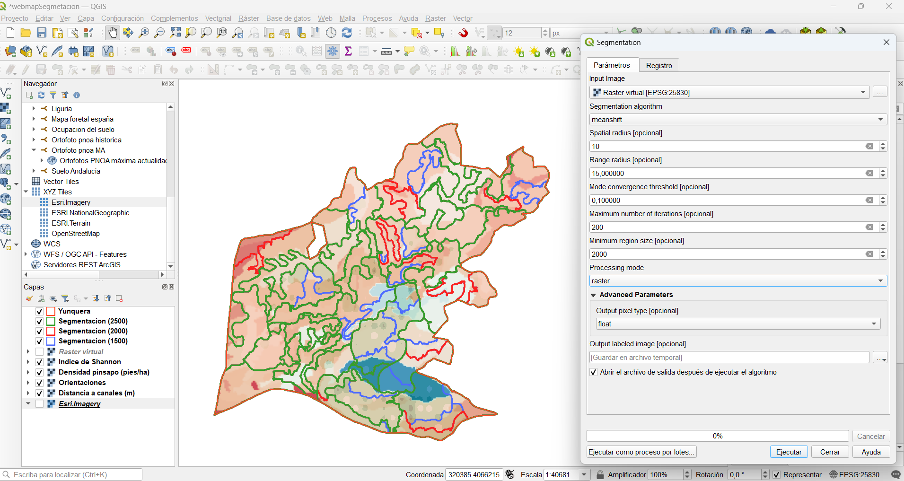

```{r librerias, include=FALSE}
library(mapview)
library(leafpop)
library(janitor)
library(tidyverse)
library(sf)
library(knitr)
library(knitrdrawio)
library(rgbif)
library(terra)
library(here)
library(stars)
library(raster)
library(spatstat)
library(RColorBrewer)
```

```{r figNumbers, echo=FALSE}
#Determine the output format of the document
outputFormat   = knitr::opts_knit$get("rmarkdown.pandoc.to")

#Figure and Table Caption Numbering, for HTML do it manually
capTabNo = 1; capFigNo = 1;

#Function to add the Table Number
capTab = function(x){
  if(outputFormat == 'html'){
    x = paste0("Tabla ",capTabNo,". ",x)
    capTabNo <<- capTabNo + 1
  }; x
}

#Function to add the Figure Number
capFig = function(x){
  if(outputFormat == 'html'){
    x = paste0("<center>Fig. ",capFigNo,". ",x,"</center>")
    capFigNo <<- capFigNo + 1
  }; x
}
```


```{r setup, include=FALSE}
knitr::opts_chunk$set(echo = TRUE,
                      warning = FALSE,
                      message = FALSE,
                      fig.align = 'center',
                      fig.dim = c(8,6),
                      engine.path = list(drawio = "C:/Program Files/draw.io/draw.io.exe"))


mapviewOptions(
  homebutton = FALSE,
  na.color = NA,
  legend.pos = "bottomright",
  trim = TRUE,
)
```


```{r klippy, echo=FALSE, include=TRUE}
klippy::klippy(
  lang = c("r", "markdown"),
  all_precode = FALSE,
  position = c("top", "right"),
  color = "auto",
  tooltip_message = "Copiar código",
  tooltip_success = "Copiado!!"
)
```

# Descripción del ejercicio {#uno}  
<hr>

El presente ejercicio se engloba dentro de la materia de *Sistemas de Información Geográfica y Ecología Espacial: Aplicaciones* del Máster Geoforest de la Universidad de Córdoba.  

El trabajo consiste en aplicar las herramientas aprendidas en clase, con lo que los productos finales esperados son:  

* Esquema general del flujo de trabajo  

* Obtención de un mapa de biodiversidad del "Pinar de Yunquera"  

* Segmentación del territorio (mediante la herramienta Orfeo en QGIS)  

* Enlace al mapa web  

* Responder a las preguntas finales  

## Datos de partida {#datos}  

Para la realización del ejercicio partimos de los siguientes datos:  

* **limite_yunquera.shp**: límite de la zona de estudio (EPSG: 25830).  

* **vegetacion_yunquera.shp**: mapa de vegetación de la zona de estudio.  

* **inventario_pinsapo.shp**: puntos de inventario de parcelas de pinsapo (*Abies pinsapo*).  

* **PNOA_MDT05_ETRS89_HU30_1051_LID.tif**: modelo digital del terreno con tamaño de píxel de 5x5 metros.  

Estos datos se encuentran en la carpeta *Cartografia/CartografiaOriginal*.  

El resto de datos de partida se obtendrán a lo largo de la resolución del ejercicio.  

## Zona de estudio {#zonadeestudio}  

Antes de comenzar a resolver el ejercicio conviene realizar una breve descripción de la zona de estudio.  

Yunquera es un municipio perteneciente a la provincia de Málaga (Andalucía), que se sitúa al oeste de la provincia.  

Al oeste del municipio de Yunquera, se encuentra el monte *Pinar de Yunquera*. En este monte encontramos especies arbóreas como *Abies pinsapo, Castanea sativa, Cedrus atlantica, Quercus faginea, Quercus ilex* subsp. *ballota, Pinus halepensis, Pinus nigra y Olea europaea* var. *europaea*. Estos se encuentran formando distintas formaciones entre las que destacan los pinsapares en masas monoespecíficas y pluriespecíficas.  

En el siguiente *webmap* se pueden explorar las diferentes formaciones vegetales presentes en el área de estudio (hacer *click* en las parcelas para explorar).  
```{r yunquera}
yunquera <- read_sf(here('Cartografia/CartografiaOriginal/limite_yunquera.shp'),
                    crs = 25830)
vegetacion <- read_sf(here('Cartografia/CartografiaOriginal/vegetacion_yunquera.shp'),
                    crs = 25830)
```

```{r, echo=FALSE}
mapview(yunquera,
        pane = "auto",
        viewer.suppress = mapviewGetOption("viewer.suppress"),
        burst = FALSE,
        color = 'red',
        legend = FALSE,
        lwd = 3,
        alpha.regions = 0,
        layer.name = 'Yunquera',
        label = F) +
  
  mapview(vegetacion,
          viewer.suppress = mapviewGetOption("viewer.suppress"),
          zcol = 'D_ARBO_PRE',
          burst = F,
          alpha.regions = 0.3,
          layer.name = 'Arbolado (%)',
          popup = popupTable(vegetacion,
                             zcol = 'COMENTARIO'))
```

<br>  

# Resolución del ejercicio  
<hr>  

Se ha dividido el ejercicio en 5 bloques de acuerdo a los objetivos del mismo.  

## Flujo de trabajo {#flujo}  

Se presenta el flujo de trabajo a continuación. También se puede visualizar directamente [aquí](https://viewer.diagrams.net/?tags=%7B%7D&highlight=0000ff&edit=_blank&layers=1&nav=1&title=workflowSIGII#G1YEsBpn8R0OUol5t4aw_K4P3HFLPbdDZd) (recomendado).  

#### {.unnumbered #workIframe}  
```{r, echo=FALSE, results='asis'}
cat(paste('<iframe frameborder="0" style="width:100%;height:800px;" src="https://viewer.diagrams.net/?tags=%7B%7D&highlight=0000ff&edit=_blank&layers=1&nav=1&title=workflowSIGII#Uhttps%3A%2F%2Fdrive.google.com%2Fuc%3Fid%3D1YEsBpn8R0OUol5t4aw_K4P3HFLPbdDZd%26export%3Ddownload" allowfullscreen="" data-external="1"></iframe>'))
```
<br>

## Mapa de biodiversidad {#biodiversidad}  

En esta sección se construirá un mapa donde se representará el Índice de Shanon:  

<center>
$$
\tag1
H' = - \sum^s_{i=1} p_i \times log_2 p_i
$$
</center>
<br>

donde:  

 * *i*: cada una de las distintas especies  
 
 * *s*: total de especies distintas  
 
 * $p_i$: abundancia relativa de cada especie en la comunidad (N individuos de la especie *i* / N total de individuos).  
 
### Descarga de ocurrencias  

En primer lugar debemos descargar las ocurrencias de [GBIF](https://www.gbif.org/). En este caso se ha creado un rectángulo en la plataforma web y se han extraído todas las ocurrencias que se encontraban dentro de este rectángulo (correspondiente a la zona de estudio).  

A continuación se importan las ocurrencias en R con el nombre de *puntos*. El siguiente paso es convertir estos puntos en un objeto espacial. Para ello se utiliza la función `sf::st_as_sf()`. La salida de esta operación (*puntos_sf*) se transforma al sistema de coordenadas en el que se está trabajando (EPSG: 25830) llamando al objeto *ocurrencias*. En la [Fig. 1](#primera) comprobamos que hemos elegido correctamente el rectángulo, y que nuestros puntos se extienden más allá de la zona de estudio asegurando la inclusión de todas las ocurrencias.  

```{r}
puntos <- read.csv(file = here('Cartografia/Tablas/ocurrences.csv'),
                   sep = "\t",
                   quote = "") |> 
  dplyr::select(scientificName,species,decimalLatitude,decimalLongitude) |> 
  drop_na()

puntos_sf <- st_as_sf(puntos,
                      coords = c('decimalLongitude','decimalLatitude'),
                      crs = 4326)

puntos_sf <- st_transform(puntos_sf,
                            crs = 25830)
```

##### {.unnumbered #primera}  
```{r puntosGBIF, echo=FALSE, fig.cap=capFig("Localización de los puntos descargados de GBIF con respecto al área de estudio")}
ggplot() +
  geom_sf(data = puntos_sf, alpha = 0.2) +
  geom_sf(data = yunquera, color = "red", fill = NA, linewidth = 1.5) +
  theme_minimal() +
  coord_sf()
```
<br>  

El siguiente paso será delimitar los puntos escogidos al rectánculo mínimo envolvente (*bounding box*) del área de estudio mediante la función `sf::st_crop()`. La razón de escoger todos los puntos incluidos dentro del rectángulo y no solamente los que están dentro del área de estudio es que como veremos en la siguiente [sección](#comunidades) trabajaremos con comunidades ecológicas de forma cuadrangular.  

```{r}
ocurrencias <- st_crop(puntos_sf, yunquera)
```

Podemos ver el resultado en la [Fig. 2](#segunda), que ascienden a un total de `r nrow(ocurrencias)` ocurrencias correspondientes a `r length(unique(ocurrencias$scientificName))` especies diferentes.  

##### {.unnumbered #segunda}  
```{r puntosFinales, echo=FALSE, fig.cap=capFig("Ocurrencias de GBIF dentro del monte de Yunquera")}
ggplot() +
  geom_sf(data = ocurrencias, alpha = 0.2) +
  geom_sf(data = yunquera, color = "red", fill = NA, linewidth = 1.5) +
  theme_minimal() +
  coord_sf()
```
<br>  

### Creación de comunidades ecológicas {#comunidades}  

Las comunidades ecológicas se asumirán que son los polígonos de la capa de vegetaciones. Para ello, en primer lugar, se crea un identificador único llamado *ID* y se seleccionan las columnas que más nos interesan. En el siguiente paso se crea una unión (`st_join()`) entre las ocurrencias y el mapa de vegetación según su intersección. De este modo podemos asignar el ID de la comunidad a cada ocurrencia. Finalmente se transforman las columnas necesarias en *data.frame* para los posteriores cálculos.  

```{r}
# Crear un ID único
vegetacion <- vegetacion |> 
  cbind(data.frame(ID = sprintf(paste("GID%0",
                                      nchar(nrow(vegetacion)),
                                      "d",
                                      sep=""), 
                                1:nrow(vegetacion)))) |> 
  dplyr::select(ID, D_ARBO_PRE:D_SUEL_PRE, D_USO:COMENTARIO)

# Añadir ID de comunidad ecologica a cada ocurrencia
ocurrencias_id <- ocurrencias |> 
  st_join(vegetacion, join = st_intersects) |> 
  mutate(id_comunidad = factor(ID),
         scientific = scientificName) |> 
  dplyr::select(-ID,-scientificName)

# Crear data frame 
bio <- data.frame(id_comunidad = ocurrencias_id$id_comunidad,
                  scientific = ocurrencias_id$scientific) |> 
  drop_na()
```


``` {r, echo=FALSE}
kable(head(bio),caption = "Tabla 1. Encabezado de la tabla de datos de ocurrencias en las distintas comunidades")
```
<br>  

En la [Fig. 3](#tercera) tenemos una representación gráfica de como quedarían estas comunidades con respecto a las ocurrencias, y en la [Fig. 4](#cuarta) vemos la densidad de puntos en la zona.  

##### {.unnumbered #tercera}
```{r grid, echo=FALSE, fig.cap=capFig("Comunidades ecológicas en el monte de Yunquera. Los puntos son todas las ocurrencias consideradas en los análisis posteriores")}
ggplot()  +
  geom_sf(data = ocurrencias, alpha = 0.2) +
  geom_sf(data = vegetacion, color = "darkgreen", linewidth = 1, fill = NA) +
  geom_sf(data = yunquera, color = "red", fill = NA, linewidth = 1.5) +
  theme_minimal() +
  coord_sf()
```
<br>

##### {.unnumbered #cuarta}  
```{r densidad, echo=FALSE, fig.cap=capFig("Mapa de densidad de ocurrencias en el monte de Yunquera")}
ggplot() +
  stat_density_2d(data = data.frame(st_coordinates(ocurrencias)), 
                  mapping = aes(x = X,
                                y = Y,
                                fill = stat(density)),
                  geom = 'tile',
                  contour = FALSE,
                  alpha = 0.8) +
  geom_sf(data = vegetacion, fill = NA) +
  geom_sf(data = yunquera, color = "red", fill = NA, linewidth = 1.5) +
  theme_minimal() +
  scale_fill_viridis_c(option = 'magma', direction = -1) +
  labs(x = "", y ="", fill = "") +
  coord_sf()
```
<br>  

### Cálculo del índice de Shannon {#H}  

El último paso de esta sección será calcular el Índice de Shannon (H). Esto lo haremos en cuatro pasos:  

 1) Calcular el número de **especies** por comunidad. En el siguiente cuadro de código se agrupa por comunidad y nombre (`group_by`), se genera una columna con el número de especies (`count()`), y se le cambia el nombre a la columna. En la [Tabla 2](#tdos) vemos el encabezado del resultado.    

```{r}
T_num_ind_sp_com <- bio |> 
  group_by(id_comunidad, scientific) |> 
  count() |> 
  rename(num_ind_sp_com = n)
```

##### {.unnumbered #tdos}  
```{r tnumind, echo=FALSE}
kable(head(T_num_ind_sp_com),
      caption = "Tabla 2. Encabezado de la tabla del número de especies por comunidad ecológica",
      align = c("c","l","c"))
```
<br>  

 2) Calcular el número de **ocurrencias** por comunidad. Realizamos un procedimiento similar, pero en este caso solamente agrupamos por comunidad. Vemos el encabezado en la [Tabla 3](#ttres).  

```{r}
T_num_ind_com <- bio |> 
  group_by(id_comunidad) |> 
  count() |> 
  rename(num_ind_com = n)
```

##### {.unnumbered #ttres}  
```{r, echo=FALSE}
kable(head(T_num_ind_com),
      caption = "Tabla 3. Encabezado de la tabla del número de ocurrencias por comunidad ecológica",
      align = c("c","c"))
```
<br>

 3) El siguiente paso calcula el Índice de Shannon (*T_Shannon*). Para ello se unen las tablas haciendo un `left_join()` que incluye todas las columnas de la [Tabla 1](#tdos) de forma que cada comunidad tendrá asociada sus especies, el número de ocurrencias de cada una, y el número total de ocurrencias de la cuadrícula de esa especie. A continuación se crean los coeficientes $p_i$ y $\log p_i$ que se utilizarán para el cálculo del índice. En la [Tabla 4](#tcuatro) vemos la estructura de los datos hasta este punto.  
Finalmente, se calcula el índice de Shannon, se seleccionan solamente las columnas necesarias y se eliminan los duplicados.  

```{r}
T_Shannon <- T_num_ind_sp_com |> 
  left_join(T_num_ind_com,
            by = 'id_comunidad') |> 
  mutate(pi = num_ind_sp_com/num_ind_com,
         logpi = log2(pi)) |> 
  group_by(id_comunidad) |> 
  mutate(shannon = sum(logpi * pi)*-1) |> 
  dplyr::select(id_comunidad, shannon) |> 
  distinct()
```

##### {.unnumbered #tcuatro} 
```{r, echo=FALSE}
kable(head(T_num_ind_sp_com |> 
  left_join(T_num_ind_com,
            by = 'id_comunidad') |> 
  mutate(pi = num_ind_sp_com/num_ind_com,
         logpi = log2(pi))),
  caption = "Tabla 4. Coeficientes para el cálculo del Índice de Shannon",
  align = c("c","l","c","c","c","c"))
```
<br>

 4) El último paso consiste en dar el valor de Índice de Shannon a cada una de las [comunidades](#tercera). Se añade un paso de reemplazar por 0 en caso de existir NA. Vemos en el *webmap* la representación final.  

```{r}
# Valor H a cada cuadricula
SF_shannon <- vegetacion |> 
  left_join(y = T_Shannon,
            by = c("ID" = "id_comunidad"))

# Sustituir NA por 0
SF_shannon$shannon <- replace_na(SF_shannon$shannon, 0)
```


```{r, echo=FALSE}
mapview(yunquera,
        pane = "auto",
        viewer.suppress = mapviewGetOption("viewer.suppress"),
        burst = FALSE,
        color = 'red',
        legend = FALSE,
        lwd = 3,
        alpha.regions = 0,
        layer.name = 'Yunquera',
        label = F) +
  
mapview(SF_shannon,
        zcol = 'shannon',
        at = c(0,0.80,1.6,2.3,2.9,9.1),
        col.regions = c('red','orange','yellow','green','blue'),
        label = paste("H =", round(SF_shannon$shannon, 2)),
        layer.name = 'Indice de Shannon',
        popup = popupTable(SF_shannon,
                           zcol = c('ID', 'shannon')))
```
<br>  

## Segmentación {#segmentacion}  

La segmentación consiste en dividir el territorio en unidades homogéneas en cuanto a unas determinadas características de las variables de entrada. El procedimiento consiste de los siguientes pasos:  

1) Elegir las variables de entrada  

2) Convertir a formato raster y homogeneizar las escalas  

3) Construir un raster virtual  

4) Segmentación del territorio  

### Variables de entrada {#variables}  

En esta sección se realizarán los pasos 1 y 2 previos. Para ello, construiremos un total de 4 variables (ver cuadro siguiente).  

<div class="cuadros">  
<center>**Variables de entrada**</center>

**Densidad de pinsapo**: información sobre la vegetación  

**Orientaciones**: información sobre el estrés abiótico derivado de la situación de solana y umbría  

**Distancia a canales**: información sobre zonas de posible compensación hídrica  

**Índice de Shannon**: información sobre la biodiversidad  
</div>  
<br>  

#### Densidad de pinsapo {.unnumbered}  

En primer lugar cargamos la capa, la cual se encuentra en CRS 25830, y la visualizamos con los límites del monte para comprobar que todo es correcto.  

```{r}
SF_pinsapo <- read_sf(here("Cartografia/CartografiaOriginal/inventario_pinsapo.shp"),
                      crs = 25830)
```


```{r, echo=FALSE}
pal <- brewer.pal(n = 6, name = "Greens")

mapview(yunquera,
        pane = "auto",
        viewer.suppress = mapviewGetOption("viewer.suppress"),
        burst = FALSE,
        color = 'red',
        legend = FALSE,
        lwd = 3,
        alpha.regions = 0,
        layer.name = 'Yunquera',
        label = F) + 
  
  mapview(SF_pinsapo,
        zcol = "Nparc",
        col.regions = pal,
        label = paste("N pies:", round(SF_pinsapo$Nparc,0)),
        layer.name = "Densidad pinsapo")
```
<br>  

El siguiente paso será crear un raster de densidad. En ese sentido, se utilizará la interpolación inversa a la distancia (IDW).  

(1) Primero se transforman los puntos a WGS 1984 ya que las funciones siguientes trabajan este sistema de coordenadas. 

```{r}
SF_pinsapo84 <- st_transform(SF_pinsapo, crs = 4326)
```


(2) A continuación obtenemos el rectángulo mínimo envolvente(*BBox84*). Se da una toleracia de 0.005º dado que al reproyectar la imagen se pierde información.    

```{r}
BBox84 <- st_bbox(SF_pinsapo84)


BBox84[c(1,3)] <- BBox84[c(1,3)] + c(-0.005,0)
BBox84[c(2,4)] <- BBox84[c(2,4)] + c(-0.005,0)
```


(3) Creamos un patrón de puntos con la función `spatstat::ppp()` utilizando el vector de coordendas X e Y, `marks` es la variable que utilizaremos para interpolar (Nparc), y en un objeto `owin()` ponemos las coordendas X e Y del rectángulo mínimo envolvente, que será la extensión de salida.  

```{r}
ppp_pinsapo <- ppp(st_coordinates(SF_pinsapo84)[,1],
                   st_coordinates(SF_pinsapo84)[,2],
                   marks = SF_pinsapo$Nparc,
                   window = owin(BBox84[c(1,3)],
                                 BBox84[c(2,4)]))
```


(4) Con la función `spatstat::idw()` realizamos la interpolación y se transforma a *raster*, que en este caso a diferencia de QGIS no tenemos opción de escoger el número de vecinos de cuáles hacer la interpolación (no obstante, la diferencia del raster de salida es mínima).  

```{r}
R_pinsapo <- ppp_pinsapo |> 
  idw(power = 2, at = 'pixels') |> 
  raster()
```

(5) Se asigna la proyección y se reproyecta al sistema 25830 cambiando la resolución a 10 metros.  

```{r}
# Asignar proyección
crs(R_pinsapo) <- crs(SF_pinsapo84)

# Transformar a 25830 y asignar resolución espacial
R_pinsapo <- projectRaster(R_pinsapo,
                           crs = 25830,
                           res = 10)
```


(6) Finalmente se hace una reclasificación de los valores del ráster y se recorta al área de estudio.  

```{r}
# Matriz de entrada para reclasificación
classMatrix <- matrix(c(0,50,0,
                        50,200,100,
                        200,400,300,
                        400,600,500,
                        600,800,700,
                        800,Inf,900),
                      byrow = T,
                      ncol = 3)

# Reclasificación y recorte al área de estudio
R_pinsapo <- R_pinsapo |> 
  reclassify(rcl = classMatrix) |> 
  mask(yunquera)
```

En el siguiente *webmap* podemos ver el resultado de los análisis anteriores.  

```{r, echo=FALSE}
pal <- brewer.pal(n = 6, name = "Greens")
mapview(yunquera,
        color = 'red',
        legend = FALSE,
        lwd = 3,
        alpha.regions = 0,
        layer.name = 'Yunquera',
        label = F) +
  
  mapview(ratify(R_pinsapo),
          col.regions = pal,
          na.color = NA,
          layer.name = 'Densidad pinsapo')
```
<br>

En el resultado vemos que a *grosso modo* las densidades más altas se encuentran al sureste del monte de Yunquera.  

<br>

#### Orientaciones {.unnumbered}  

La segunda de las capas se corresponde con la de orientaciones. En este caso cargamos el modelo digital del terreno (mdt), calculamos las orientaciones en grados con la función `raster::terrain()`. El siguiente paso será hacer coincidir espacialmente ambos raster con la misma resolución (`resample()`). Finalmente lo reclasificaremos teniendo en cuenta lo siguiente:  

* **1**: zonas de umbría alta (Norte).  

* **2**: zonas de umbría (Noreste, Noroeste).  

* **3**: zonas medias (Este, Oeste).  

* **4**: zonas de solana (Sureste, Suroeste).  

* **5**: zonas de solana alta (Sur).  

```{r}
# Cargar capa y cortar a la extensión de Yunquera
mdt <- raster(here("Cartografia/CartografiaOriginal/PNOA_MDT05_ETRS89_HU30_1051_LID.tif"),
              crs = "+proj=utm +zone=30 +ellps=GRS80 +units=m +no_defs") 

# Cálculo orientaciones
orientaciones <- terrain(mdt,
                         opt = 'aspect',
                         unit = 'degrees') |> 
  resample(R_pinsapo)

# Matriz de clasificación
mat <- matrix(c(-Inf, 22.5,1,
                22.5,67.5,2,
                67.5,112.5,3,
                112.5,157.5,4,
                157.5,202.5,5,
                202.5,247.5,4,
                247.5,292.5,3,
                292.5,337.5,2,
                337.5,Inf,1),
              ncol = 3,
              byrow = TRUE)

# Reclasificación y recorte al área de estudio
R_orientaciones <- orientaciones |> 
  reclassify(rcl = mat) |> 
  mask(yunquera)
```


```{r, echo=FALSE}
RC_orientaciones <- ratify(R_orientaciones)
x <- levels(RC_orientaciones)[[1]]
x$code <- c("Umbria alta","Umbria","Zona media","Solana","Solana alta")
levels(RC_orientaciones) <- x

aspal <- c("#3076E1", "#97E0ED","#F7E912","#F3823C","#F11512")

mapview(yunquera,
        color = 'red',
        legend = FALSE,
        lwd = 3,
        alpha.regions = 0,
        layer.name = 'Yunquera',
        label = F) +
  
  mapview(RC_orientaciones,
          na.color = NA,
          col.regions = aspal,
          layer.name = 'Orientaciones')
```
<br>  

Con el *webmap* y la siguiente tabla a modo informativo vemos que el monte tiene mayor superficie de laderas expuestas a umbría que a solanas.  

```{r}
values(RC_orientaciones) |> 
  tabyl() |> 
  adorn_pct_formatting()
```

<br>

#### Distancia a canales {.unnumbered}  

El ráster de distancia a canales se ha calculado previamente siguiendo los pasos del [guión](https://ruizgomezfj.github.io/GEOFOREST_SIG2/guion_practica_2022.html#Preparaci%C3%B3n_de_capas_raster:) en QGIS debido a la complicidad de realizar este análisis en R. La capa obtenida se muestra en el siguiente *webmap*, la cual se encuentra en el sistema de coordenadas correspondiente y con `resample()` nos aseguramos de que coincida espacialmente con el resto de capas.  

```{r}
R_dist_canales <- raster(here("Cartografia/CartografiaOriginal/Raster_dist_cauces.tif")) |> 
  resample(R_pinsapo) |> 
  mask(yunquera)
```


```{r, echo=FALSE}
mapview(yunquera,
        color = 'red',
        legend = FALSE,
        lwd = 3,
        alpha.regions = 0,
        layer.name = 'Yunquera',
        label = F) +
  
  mapview(R_dist_canales,
          col.regions = brewer.pal(10,"RdBu"),
          layer.name = "Distancia (m)")
```
<br>  

#### Indice de Shannon {.unnumbered}  

El indice de Shannon se ha calculado en la sección [2.2.3](#H). En este caso nos quedaría rasterizar el resultado y remuestrearlo para que coincida espacialmente con el resto de capas.  

```{r}
R_shannon <- SF_shannon |>
  dplyr::select(shannon) |> 
  st_rasterize() |> 
  as("Raster") |> 
  resample(R_pinsapo) |> 
  mask(yunquera)
```

```{r, echo=FALSE}
mapview(yunquera,
        color = 'red',
        legend = FALSE,
        lwd = 3,
        alpha.regions = 0,
        layer.name = 'Yunquera',
        label = F) +
  
  mapview(vegetacion,
          viewer.suppress = mapviewGetOption("viewer.suppress"),
          zcol = 'D_ARBO_PRE',
          burst = F,
          legend = F,
          alpha.regions = 0,
          layer.name = 'Arbolado (%)',
          popup = popupTable(vegetacion,
                             zcol = 'COMENTARIO')) +
  
  mapview(R_shannon,
          col.regions = brewer.pal(10,"RdBu"),
          layer.name = "Indice de Shannon") 
```
<br>  

En el *webmap* anterior vemos que las zonas de mayor biodiversidad se encuentran en la zona sureste. Se puede interactuar con el mapa poder ver el porcentaje de arbolado y el tipo de formación vegetal en las diferentes áreas.

#### Guardar las capas {.unnumbered}  

Finalmente se exportan las capas a la carpeta *CapasDefRaster*.  

```{r}
# writeRaster(R_pinsapo,
#             filename = here("Cartografia/CapasDefRaster/R_pinsapo.tif"),
#             overwrite = T)
# 
# writeRaster(R_orientaciones,
#             filename = here("Cartografia/CapasDefRaster/R_orientaciones.tif"),
#             overwrite = T)
# 
# writeRaster(R_dist_canales,
#             filename = here("Cartografia/CapasDefRaster/R_dist_canales.tif"),
#             overwrite = T)
# 
# writeRaster(R_shannon,
#             filename = here("Cartografia/CapasDefRaster/R_shannon.tif"),
#             overwrite = T)
```

<br>  

### Raster virtual {#virtual}  

El ráster virtual se ha creado en QGIS mediante la herramienta *Raster -> Micelanea -> Crear raster virtual*.  

El resultado se muestra en la [Fig. 5](#quinta).  

##### {.unnumbered #quinta}  
```{r,echo=FALSE, out.width = "1200px", fig.cap=capFig("Creación del Raster virtual en QGIS a partir de las cuatro capas de entrada")}
knitr::include_graphics("Imagenes/rvirtual.png")
```
<br>  

### Segmentación del territorio {#segm}  

El último paso de esta sección consiste en realizar una segmentación del monte de Yunquera utilizando el ráster virtual creado en la sección anterior. Para ello, se utilizará la herramienta [Orfeo Toolbox](https://www.orfeo-toolbox.org/) en la interfaz de QGIS.  

Para llevar esta tarea a cabo, con Orfeo correctamente instalado, se debe ir a *Caja de herramientas de Procesos -> OTB -> Segmentation -> Segmentation*. Una vez ahí, se seleccionan las opciones de la [Fig. 6](#sexta). La opción "*Minimum region size*" se probó con varios valores (el resultado debe convertirse a polígono). En el *webmap* que se verá posteriormente se analizarán las diferencias e influencia de las diferentes capas de entrada en los resultados.  

##### {.unnumbered #sexta}  
```{r,echo=FALSE, out.width = "1200px", fig.cap=capFig("Parámetros utilizados en la segmentación")}

```
<br> 

Para finalizar la tercera tarea de la práctica, se cargan las tres capas creadas con Orfeo en QGIS.  

```{r}
segmentation1500 <- read_sf(here("Cartografia/CapasDefVectorial/segmentacion1500.shp"))

segmentation2000 <- read_sf(here("Cartografia/CapasDefVectorial/segmentacion2000.shp"))

segmentation2500 <- read_sf(here("Cartografia/CapasDefVectorial/segmentacion2500.shp"))
```

En el *webmap* siguente se puede jugar con las capas para ver el efecto de las distintas segmentaciones en cada una de las capas.  

```{r,echo=FALSE}
mapviewOptions(
  homebutton = FALSE,
  na.color = NA,
  trim = T,
  query.type = "mousemove",
  fgb = F,
  legend.pos = "bottomleft",
  layers.control.pos = "bottomright",
  leafletHeight = 600,
  leafletWidth = 1000
)
```


```{r,echo=FALSE}
m <- mapview(segmentation1500,
          alpha.regions = 0,
          lwd = 2,
          color = '#104FC6',
          col.regions = '#104FC6',
          layer.name = "Segmentación (1500)") +
  
  mapview(segmentation2000,
          alpha.regions = 0,
          lwd = 2,
          color = '#B22E21',
          col.regions = '#B22E21',
          layer.name = "Segmentación (2000)") +
  
  mapview(segmentation2500,
          alpha.regions = 0,
          lwd = 2,
          color = '#087639',
          col.regions = '#087639',
          layer.name = "Segmentación (2500)") +
  
  mapview(R_pinsapo,
          col.regions = pal,
          layer.name = 'Densidad pinsapo') +
  
  mapview(R_shannon,
          col.regions = brewer.pal(n = 5, name = "RdYlGn"),
          layer.name = 'Indice de Shannon') +
  
  mapview(RC_orientaciones,
        col.regions = aspal,
        layer.name = 'Orientaciones',
        alpha.regions = 0.7) +
  
  mapview(R_dist_canales,
          col.regions = brewer.pal(10,"RdBu"),
          layer.name = "Distancia a canales (m)")

m
```
<br>  

<div class="cuadros">
**Nota**: los bordes de la segmentación no coinciden totalmente con el borde de los ráster. Esto se debe a que las capas se encuentran en crs 25830, pero el webmap se representa en Web Mercator (EPSG: 3857). A modo de análisis no afecta, pero las conclusiones finales se tomarán sobre el *Web Map* publicado de la siguiente [sección](#webmap).</div>  

Los resultados se discuten en las [cuestiones finales](#cuestiones). No obstante, se hará una breve discusión sobre las tres composiciones de segmentación creadas.  

Para analizar los resultados podemos activar en primer lugar *Segmentacion (2000)*, y a continuación *Segmentacion (2500)* (el orden es importante para su superposición). Tras hacer esto, podemos activar las variables una a una empezando por *Densidad pinsapo*, *Indice de Shannon*, *Orientaciones* y *Distancia a canales (m)*. La segmentación de 2500 píxeles como unidad mínima se tratará como **segmentación inicial**, y las unidades segmentadas como **cantones**.  

Lo primero que podemos ver es que si segmentamos con unidad mínima de 2000, se crean 11 cantones a mayores. La segmentación inicial parece separar muy bien áreas con alta densidad de pinsapo de áreas con baja densidad. Al aumentar el número de cantones no se ve una clara separación de nuevas áreas con densidad de pinsapo diferentes.  

Si activamos el índice de Shannon vemos que la relación no es tan clara como con la variable anterior. Sin embargo, sí que se ve como la segmentación va aproximadamente paralela a zonas de alta biodiversidad para separar zonas de menor biodiversidad. Además, aumentar el número de cantones parece tener una relación algo mayor con esta variable.  

Con respecto a la capa de orientaciones, al ser la más irregular, los patrones de segmentación pueden ser más complicados de identificar. Sin embargo, vemos que en zonas donde la densidad de pinsapo y el índice de Shannon (en menor medida) eran aproximadamente uniformes (norte, oeste), la segmentación produce diferencias entre solanas, zonas medias y umbrías bastante claras. El aumento del número de cantones no parece estar muy influenciado por esta variable, aunque al oeste y al norte se pueden ver algunas divisiones más o menos claras.  

La variable de distancia a canales también parece tener una gran influencia para separar zonas muy cercanas a canales de zonas muy alejadas. El aumento del número de cantones en la mayoría de los casos se ve muy correlacionado con esta variable.  

Si hacemos el mismo procedimiento tomando como capa inicial *Segmentación (2000)* y la comparamos con *Segmentación (1500)*, vemos que los cantones generados a mayores generan unas irregularidades que a modo de gestión pueden no ser convenientes

Dependiendo del tipo de gestión que llevemos a cabo nos puede interesar más una segmentación u otra. En este monte donde podemos tener preferencias de protección y conservación del pinsapo puede que un tamaño de parcela muy grande no nos interese. En este sentido, el tamaño de píxel mínimo de 2500 crea muchos cantonesde superficie superior a 60 ha por lo que se puede hacer demasiado grande de gestionar para estos objetivos ([Fig. 7C](#septima)). Si activamos en el *webmap* la capa de *segmentación (2000)* y *densidad pinsapo* podemos ver claramente dos cantones con alta densidad de pinsapo situados en la esquina sureste (cantón 69) y otro situado al noroeste de este (cantón 56) que su tamaño puede ser demasiado grande para una gestión más eficiente. Viendo el valor del resto de variables en estos dos cantones, vemos que existe una heterogeneidad notable. Por ello, si activamos *segmentación (1500)* vemos que estos cantones quedan separados en una mayor número de unidades. En conclusión, se considera que para una gestión forestal del pinsapo nos interesa una segmentación mayor de las zonas de pinsapo que atiendan al resto de variables consideradas. Por ello, para las cuestiones finales se responderá tomando como elección una segmentación con tamaño mínimo de 1500 píxeles.  

#### {.unnumbered #septima}
```{r,fig.cap=capFig("Histogramas del tamaño de parcela. A) Tamaño mínimo de píxel = 1500; B) tamaño mínimo de píxel = 2000; C) tamaño mínimo de píxel = 2500")}
par(mfrow = c(1,3))
hist(as.vector(st_area(segmentation1500))[as.vector(st_area(segmentation1500))>200]/10000,
     ylab = "",
     xlab = "Superficie (ha)",
     main = "A")

hist(as.vector(st_area(segmentation2000))[as.vector(st_area(segmentation2000))>200]/10000,
     ylab = "",
     xlab = "Superficie (ha)",
     main = "B")

hist(as.vector(st_area(segmentation2500))[as.vector(st_area(segmentation2500))>200]/10000,
     ylab = "",
     xlab = "Superficie (ha)",
     main = "C")
```


```{r, include=FALSE}
mapshot(m,
        url = "segmentationMap_ACG.html")
```

<br>

## Webmap {#webmap}  

El cuarto objetivo era crear un *webmap* y publicarlo. Para ver dicho mapa, hacer click [aquí](https://cidree.github.io/Segmentacion_ACG/).  

## Cuestiones finales {#cuestiones}  

<p class="preguntas">Consideras que el resultado es consistente con la realidad que conoces del terreno? Justifica tu respuesta.</p> 

Teniendo en cuenta las variables consideradas sí que es consistente el resultado. No obstante, si superponemos la segmentación junto a una imagen aérea podemos ver que al no tener en cuenta los caminos o pistas, la segmentación ignora estos elementos del paisaje que son clave en la creación de cantones para una gestión más sencilla y eficiente. Por ello, a efectos prácticos puede perder consistencia. Por otro lado, si nos fijamos en cuando a homogeneidad de las masas forestales en cuanto a su densidad (en la imagen aérea) podemos ver una alta correlación.  

<p class="preguntas">Cuál de las capas (variables) utilizada aparenta tener más influencia en el resultado final?  Por qué crees que pasa esto?</p>  

Densidad pinsapo > distancia a canales > índice de Shannon > orientación.  

En las zonas de cambio de densidad de pinsapo, el resto de variables parecen ser también más o menos homogéneas, y en donde cambia la densidad de pinsapo, es donde se producen cambios mayores en la densidad de los píxeles dado que esta variable produce unos cambios de densidad mayores al resto.  

<p class="preguntas">Para qué aspectos de la gestión del territorio crees que sería de utilidad la cartografía obtenida?</p>  

Principalmente para una gestión forestal del pinsapo ya que tenemos bien separados los cantones de mayor densidad que los de menor densidad. Si añadimos un estudio de fauna, podríamos analizar qué especies están presentes en el monte y por qué unas zonas tienen una biodiversidad mucho mayor que otras para, en medida de lo posible y sin perjudicar otros usos que pueda tener el monte que no se quieran perder, aumentar la biodiversidad en otras zonas.  

<p class="preguntas">Cómo mejorarías el resultado? Incorpora alguna sugerencia sobre mejoras técnicas y/o nuevas variables a incorporar.</p>  

Para añadir nuevas variables y mejorar el resultado es indispensable saber qué tipo de gestión de llevará a cabo. En este caso se considera la gestión forestal del pinsapo:

Para realizar gestión forestal, es interesante aprovechar la red viaria disponible en el monte ya que se definen límites más claros para el gestor forestal y porque son aprovechados para la extracción de madera. Además, si cortamos el MDT a la extensión del monte vemos que existe un gradiente altitudinal de 1000 metros, que va a influir mucho en el desarrollo de la vegetación. De este modo, añadir una variable de distancia a caminos y la altitud podría ser una buena idea para una gestión forestal. Finalmente podríamos suavizar los bordes de los cantones.  


# Información de la sesión {.unnumbered}  

```{r, echo=FALSE}
sessionInfo()
```


